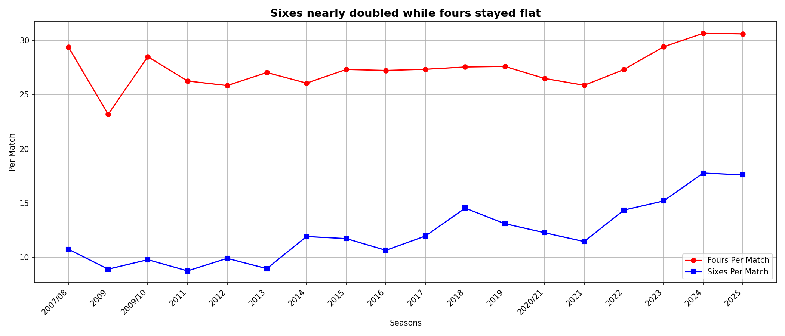
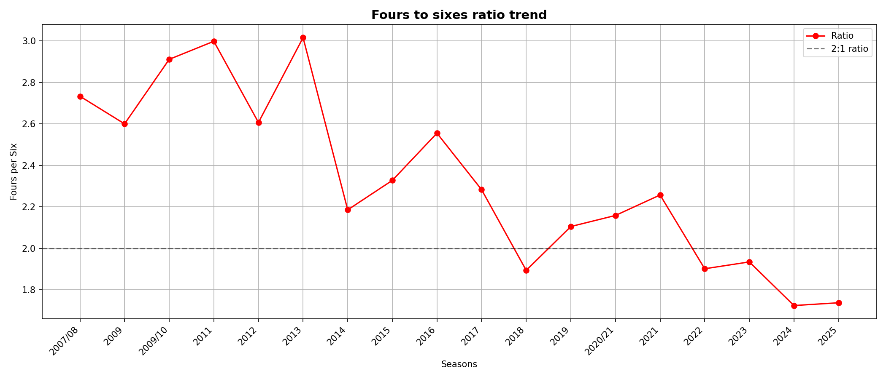
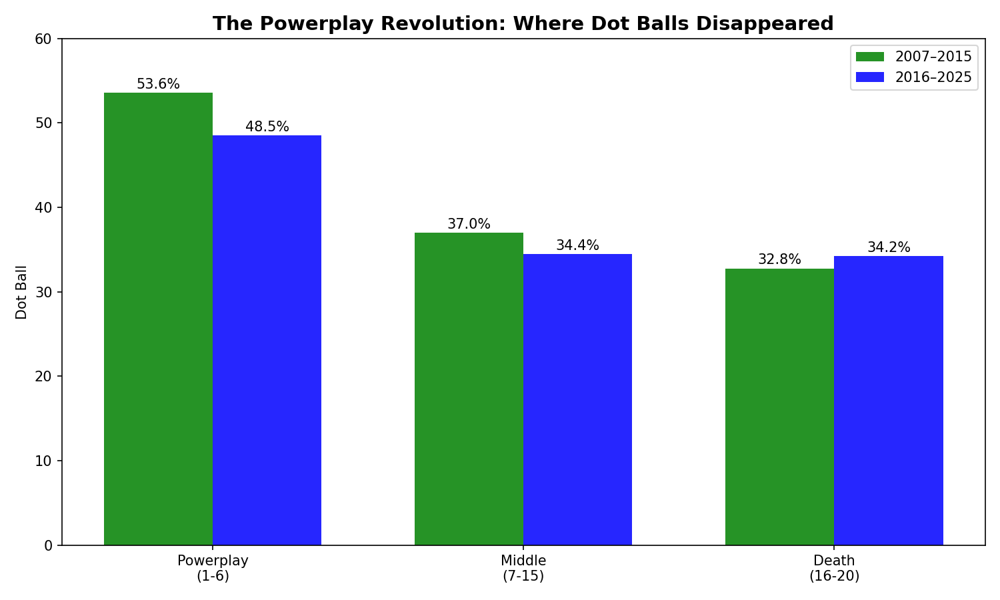
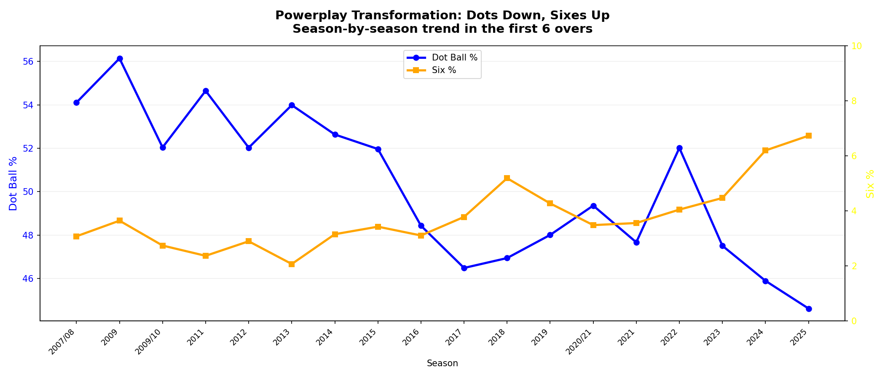
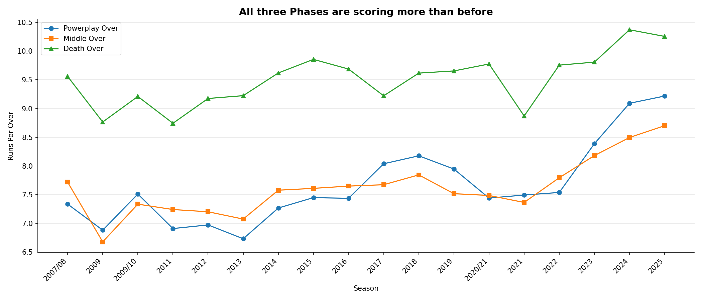
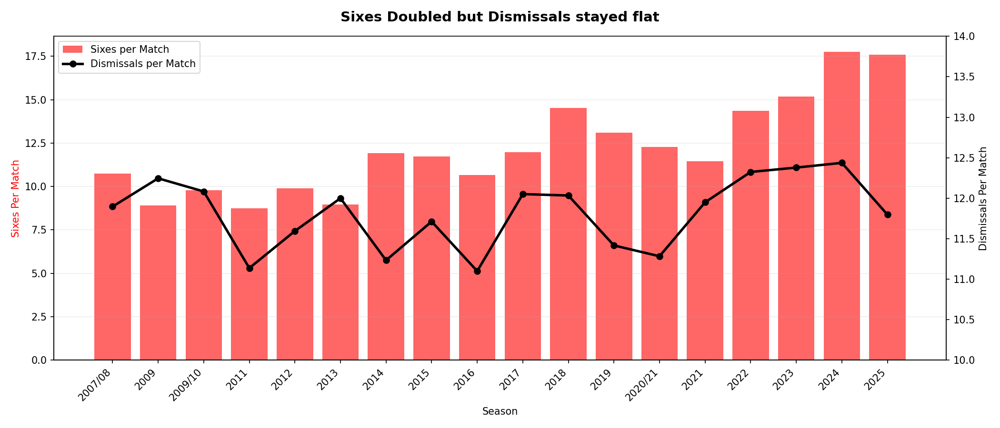
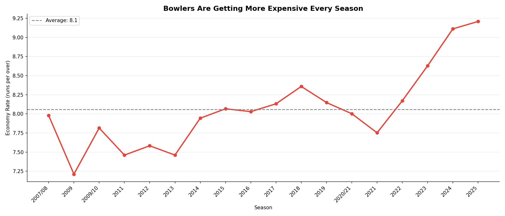
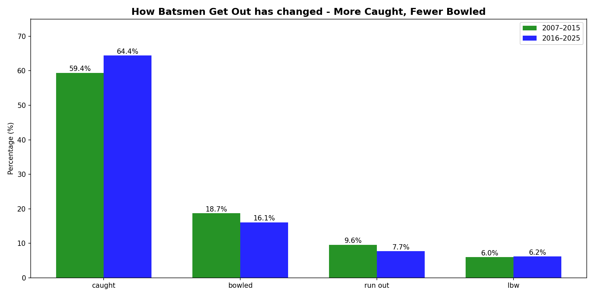

# 🏏 From Dots to Damage - How IPL Batsmen Eliminated Dot Balls
### ***IPL Analytics Hackathon - Phase 1 Submission***

## The Question
The IPL has been running for 18 seasons. I wanted to know has the way batsmen score actually changed over time? And if so, where in the innings did it change the most, and did it come at a cost?

As someone who isn't a big cricket lover, I don't follow cricket, I just followed the data. Here's what it told me.

Since this analysis should be readable by anyone (including people like me who are new to cricket), here are the key terms used throughout:
- **Innings:** One team's turn to bat. Each IPL match has 2 innings, one per team.
- **Over:** A set of 6 legal balls bowled by one bowler. Each innings has 20 overs (assets/120 balls total).
- **Dot ball:** Any delivery where zero runs are scored. The batsman either misses, defends, or the fielder stops the ball. From the batting team's perspective, a dot ball is wasted, you only get 120 balls, so every dot is an opportunity lost.
- **Boundary:** A 4 (when ball rolls to the boundary rope) or a 6 (ball flies over it).
- **Powerplay (Overs 1-6):** The opening phase where fielding restrictions limit how players can stand far from the batsman. In  theory, this should favour attacking batting but the ball is also brand new and moves more, so bowlers get early wickets here. That's why the dot ball % is highest in the powerplay, batsmen play cautiously against good bowling even though the field is in their favour.
- **Middle (Overs 7-15):** The "build" phase. Field restrictions are lifted, so the fielding team spreads out. Batsmen traditionally take singles and rotate strike here, waiting for the occasional bad ball to hit a boundary. It's the least exciting phase.
- **Death (Overs 16-20):** The finishing phase. Batsmen go all-out because they are running out of balls. This is where the sixes pile up. Bowlers try full-length balls aimed at the batsman's feet to limit damage.
- **Dismissal/Wicket/Getting Out:** A batsman is forced to stop batting. Common types: caught (fielder catches the ball), bowled (ball hits the stumps), LBW (leg blocks the stumps).
- **Strike Rate:** Runs scored per 100 balls, measures how fast a batsman scores.
- **Run Rate:** Runs scored per over, measures the scoring speed of a team.

## Dataset
1. **Source:** IPL ball-by-ball data (2007-2025) from Cricsheet, 
2. **Deliveries:** 278,205 rows - every ball bowled across 18 seasons
3. **Matches:** 1,169 rows - match-level metadata
4. **Tools used:** Python - pandas, matplotlib, seaborn

## Key Findings
**1. Sixes nearly doubled - fours stayed flat**
Over 18 IPL seasons, sixes per match nearly doubled from around 9 to 18, while fours per match barely changed, staying around 26-30. This tells us that batsmen aren't just scoring more, they are specifically hitting more sixes. The way runs are scored has fundamentally shifted towards power hitting.

   

**2. The Fours-to-Sixes ratio collapsed**
In 2011 and 2013, there were 3 fours for every six hit. By 2024, that ratio dropped to 1.7. Batsmen have shifted from finding gaps and running between wickets to swinging for the boundary. In other words, the ratio of fours to sixes dropped from 3:1 in the early seasons to 1.7:1 by 2024. Batsmen used to score 3 fours for every six they hit. Now it's almost equal. This confirms that the shift isn't just about scoring more, it's about how they score. 

**3. Where did the extra runs come from? Dot balls disappeared.**
Looking at percentage of balls result in dots, singles, fours, and sixes, the answer is clear. In other words, dot balls dropped significantly in the powerplay (53.6% to 48.5%) and middle overs (37% to 34.3%), but slightly increased in the death overs (32.9% to 34.2%). The powerplay saw the biggest shift, batsmen stopped defending and started attacking from ball one. The death over tells a different story, more dots alongside more sixes suggests a boom-or-bust approach where batsmen swing for maximum power, resulting in either a six or a complete miss.

**4. The Powerplay is where the revolution happened**
Tracking the powerplay season by season reveals a clear turning point around 2016. Before that, dot balls stayed above 52% and sixes stayed below 4%. After 2016, the two lines diverge, dot balls steadily fall toward 44% while sixes climb to nearly 7% by 2025. The powerplay went from cautious phase to an attacking one.

**5. Every phase got more aggressive but the Powerplay changed the most**
All three phases of the innings show increasing runs per over, but the powerplay saw the biggest relative jump. In early seasons, the powerplay scored around 7 runs per over, well below the death overs at 9.5. By 2025, the powerplay reached over 9 runs per over, close to where death overs were a decade ago. The gap between phases is shrinking as batsmen attack aggressively from the start.

**6. Over 7 - the boundary cliff that never changed**
Boundary percentage increased across most overs between the two eras, with the biggest gains in the powerplay (overs 2-6) and death overs (assets/18-20). The over-by-over breakdown reveals that over 7 (when fielding restrictions are lifted) has been the hardest over to hit boundaries in for all 18 seasons. Everything around it got more aggressive. This is the over when fielding restrictions are lifted and the fielding team can spread their players out. 

**7. 18 years of Boundaries in one image**
This captures the entire story in one image, boundary percentage for every over in every season. The most striking feature is the bottom-left corner turning deep red, powerplay overs in recent seasons have the highest boundary rates in IPL history. Over 7 appears as a pale stripe running from top to bottom, it has been the lowest boundary over for all 18 seasons regardless of era. The bottom-right corner also darkens, showing death overs getting more aggressive. You can literally see the batting revolution happening from top to bottom. 

**8. The Free Lunch - More Aggressive, same dismissals**
Despite all the increased aggression, sixes doubling, dot balls dropping, boundaries increasing across the powerplay, the dismissal rate per match has stayed flat at around 12 across all 18 seasons. Batsmen aren't getting out more often even though they are swinging harder. This suggests the shift toward power hitting wasn't reckless, batsmen developed the skill to be aggressive without sacrificing their wickets.

**9. Sixes doubled, wickets didn't - side by side**
This chart overlays sixes per match (bars) with dismissals per match (line) to make the contrast undeniable. Sixes nearly doubled from ~9 to ~18 per match, while dismissals stayed flat at around 12. The two metrics moved completely independently, the aggression came at no cost.

**10. The Aggressive Index - one number for 18 years of change**
The Aggressive Index that is a metric calculated by combining the boundary percentage, six percentage and the dot ball percentage into one number which shows a steady climb from -26 in 2009 to -8 in 2025. This captures the entire story of this analysis in a single line, IPL batting intent has been systematically increasing for over a decade. It's not a sudden change, it's a gradual, sustained reprogramming of how batsmen approach the game.

## The Bowlers side of the Story
The first 10 findings told the batting story. But every ball has two sides, if batsmen got more aggressive, what happened to the bowlers?

**11. The Bowler's Price - Economy Rates hit all time highs**
The economy rate - how many runs bowlers are giving away per over, climbed from 7.2 in 2009 to 9.2 in 2025. Bowlers are giving away 2 extra runs per over compared to the early seasons. This is the other side of the batting revolution, as batsmen got more aggressive, bowlers paid the price.

**12. How Batsmen Get out has changed, More Caught, Fewer Bowled**
The way batsmen get out has shifted in exactly the way you'd expect from the aggression revolution. 'Caught' dismissals rose from 59.4% to 64.4%, batsmen are swinging harder and hitting the ball in the air more, giving fielders more catching opportunities. 'Bowled' dropped from 18.7% to 16.1% because batsmen are attacking rather than defending, so they're less likely to miss a defensive shot and lose their stumps. 'Run out' fell from 9.6% to 7.7% because batsmen are hitting boundaries instead of running between wickets, you can't get run out if the ball goes to the fence.

## The Takeaway
IPL batting has been fundamentally reprogrammed over 18 seasons. Batsmen have learned to convert dot balls into boundaries, especially in the powerplay without getting out more often. This wasn't reckless slogging. It was a systematic skills upgrade across the entire innings.

The biggest surprise? The revolution didn't happen in the death overs where you'd expect it. It happened in the powerplay, the first six overs where the dot ball rates dropped by nearly 6 percentage points and boundary rates jumped significantly. 

And the cost of all this aggression? Zero. Dismissals per match stayed flat at ~12 for 18 years straight.

## Novel Contributions
- **The Aggression Index:** A compsite metric (Boundary% + Six% - Dot%) that captures the shift in batting intent in a single number across seasons. This is not a standard cricket metric, it was created for this analysis.
- **The Over 7 Insight:** Most cricket analysis focuses on powerplay and death overs. This project highlights that over 7, the moment fielding restrictions lift, is a boundary cliff that has remained unchanged for 18 years. 
- **The "Free Lunch":** The aggression revolution came at no cost in terms of dismissals, 18 seasons of flat dismissal rates alongside doubling six-hitting rates.

## How to Run
1. Clone this repo
2. Place 'deliveries_updated_ipl_upto_2025.csv' and 'matches_updated_ipl_upto_2025.csv' in the root directory 
3. Run 'pip install pandas matplotlib, seaborn, numpy'
4. Open 'jupyter notebook IPL_Analysis.ipynb'

## Project Structure
1. 01_sixes_vs_fours_per_match.png
2. 02_ratio_fours_vs_sixes_per_season.png
3. 03_powerplay_dot_ball_revolution.png
4. 04_powerplay_dots_vs_sixes.png
5. 05_runs_per_over_by_phase.png
6. 06_boundary_pct_by_over.png
7. 07_boundary_heatmap.png
8. 08_dismissals_per_match.png
9. 09_sixes_vs_dismissals.png
10. 10_aggression_index.png
11. 11_economy_rate_by_season.png
12. 12_dismissal_types_by_era.png
13. IPL_Analysis.ipynb
14. README.md

----

