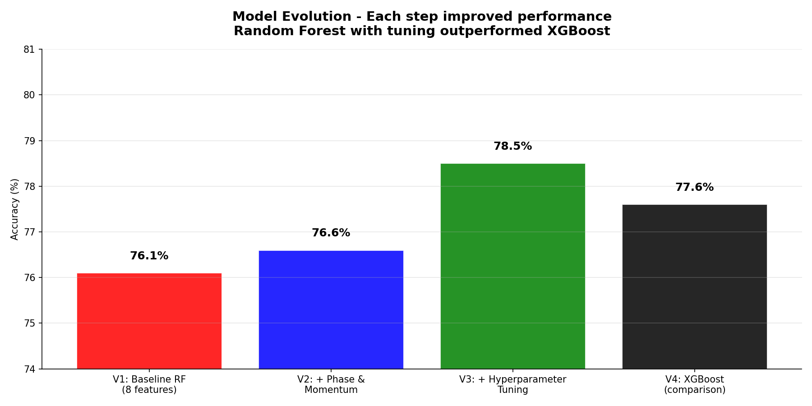
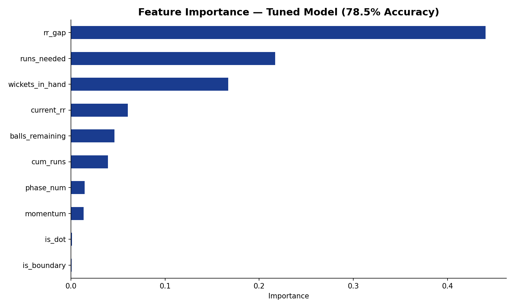
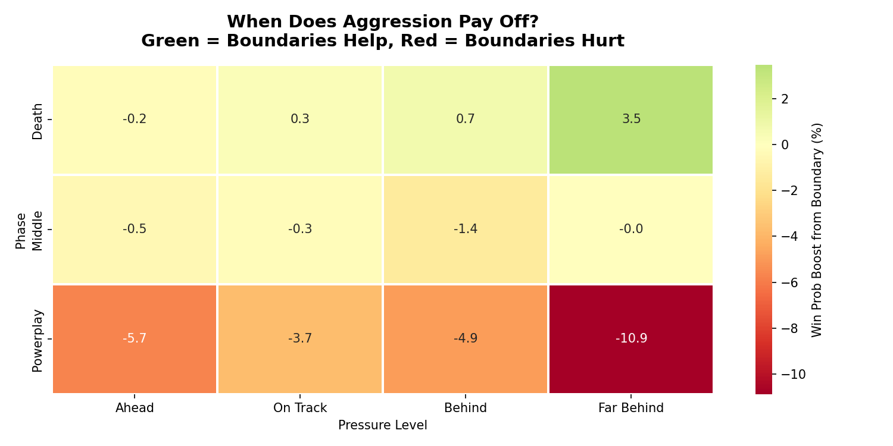
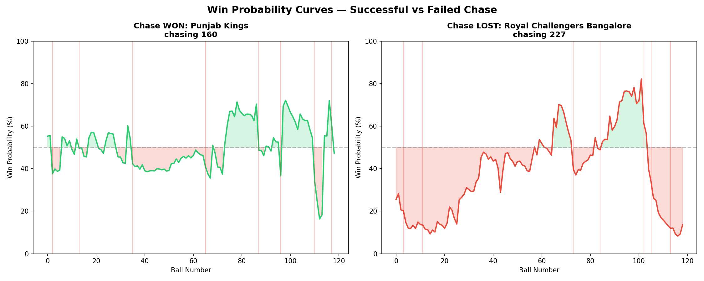
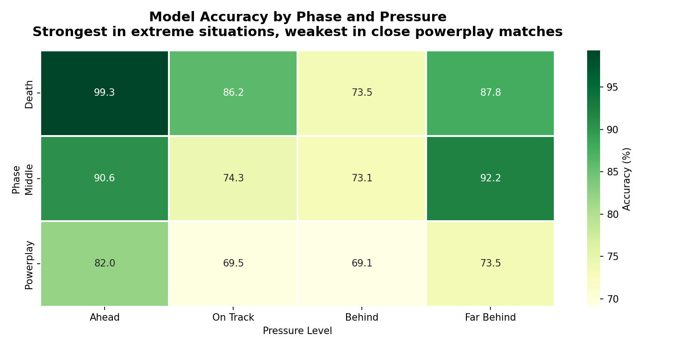
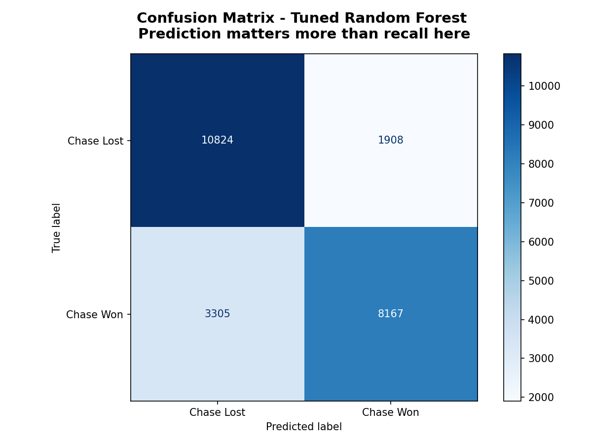

# Phase 2: When Should IPL Teams 🏏 Attack? Predicting the Aggression-Risk Trade-off

## The Question

In [Phase 1](https://github.com/Sid-art6/IPL-Analysis-and-Prediction/tree/main/Phase_1), I discovered that IPL batting aggression doubled over 18 seasons - sixes nearly doubled from ~9 to ~18 per match, dot balls dropped significantly, and boundary rates surged. But dismissals per match stayed flat at ~12 for all 18 years. It looked like a free lunch.

**Phase 2 asks: is it really free?** Given a specific match state - the over, wickets in hand, runs needed, and current run rate, should a team attack or defend? I built a ball-by-ball win probability model to answer this.

**The answer: aggression is NOT equal everywhere.**
- In **death overs when behind**: boundaries boost win probability by +3.5% → **Attack**
- In the **powerplay**: boundaries REDUCE win probability by up to -10.9% → **Defend**

The 18-year aggression revolution was smart overall, but the optimal strategy is: **survive early, attack late.**

---

## Dataset
- **Source:** IPL ball-by-ball data (2007–2025) from Cricsheet,
- **Deliveries:** 278,205 rows - every ball bowled across 18 seasons
- **Matches:** 1,169 rows - match-level metadata
- **Innings 2 only:** 130,282 deliveries used for chase prediction (after cleaning)
- **Tools:** Python - pandas, scikit-learn, streamlit, GridSearchCV, XGBoost, matplotlib, seaborn
- **AI Tools:** Claude Opus 4.6 and Antigravity for streamlit app

---

## Approach

```
Phase 1 Discovery                    Phase 2 Prediction
─────────────────                    ──────────────────
"Aggression doubled,          →      "When does aggression
 dismissals stayed flat"              actually pay off?"
         │                                    │
         ▼                                    ▼
  Aggression Index                Ball-by-ball win probability
  (Boundary% + Six%                model using Random Forest
   − Dot%)                         on innings 2 chase data
         │                                    │
         ▼                                    ▼
  "The free lunch"                   The Strategy Matrix:
                                     Attack in death overs,
                                      Defend in powerplay
```

---

## Methodology

### Data Preparation
1. Filtered to innings 2 (chasing team) - 130,282 deliveries across 1,088 matches
2. Removed completed chases, infinite required run rates, and post-match deliveries
3. Created match-state features for every delivery

### Feature Engineering

| Feature | What It Captures | Why It Matters |
|---------|-----------------|----------------|
| `cum_runs` | Runs scored so far | How much progress has been made |
| `runs_needed` | Runs left to chase | How far away is the target |
| `current_rr` | Current run rate | How fast the team is scoring |
| `wickets_in_hand` | Wickets remaining (10 minus fallen) | Resources left |
| `balls_remaining` | Legal balls left | Time pressure |
| `rr_gap` | Required RR minus current RR | **The pressure metric** - how much faster do they need to score? |
| `is_boundary` | Was this ball a 4 or 6? | Single-ball aggression indicator |
| `is_dot` | Was this ball a dot? | Single-ball defensive indicator |
| `phase_num` | Powerplay (1), Middle (2), Death (3) | Same situation means different things in different phases |
| `momentum` | Runs in the last 6 balls | Short-term batting rhythm |

**Correlation check:** Removed `over_num` (perfectly correlated with `balls_remaining`) and `required_rr` (0.99 correlation with `rr_gap`) to avoid redundancy.

### Train-Test Split
- **Training:** 106,079 deliveries from 948 matches. Seasons 2007–2022 (older data)
- **Testing:** 24,204 deliveries from 216 matches. Seasons 2023–2025 (most recent data)
- **No data leakage:** Temporal split ensures the model never sees future data

### Model Evolution

| Version | Changes | Accuracy |
|---------|---------|----------|
| V1: Baseline Random Forest | 8 features, default parameters | 76.1% |
| V2: + Feature Engineering | Added phase and momentum | 76.6% |
| V3: + Hyperparameter Tuning | GridSearchCV (108 combinations × 3-fold CV) | **78.5%** |
| V4: XGBoost (comparison) | Gradient boosting alternative | 77.6% |

**Winner: Tuned Random Forest (V3)** with `max_depth=10`, `min_samples_leaf=2`, `min_samples_split=5`, `n_estimators=300`



---

## Key Findings

### 1. Pressure (rr_gap) Is the #1 Predictor

The gap between required run rate and current run rate drives **44% of prediction importance**. Not individual shots, not the over number - the cumulative pressure state.



### 2. Individual Balls Don't Matter - Match State Does

`is_boundary` and `is_dot` have near-zero feature importance. Matches are decided by the cumulative situation, not any single delivery. This makes sense - one six doesn't win a match, but a growing run rate gap does.

### 3. The Aggression Strategy Matrix - When Phase 1 Meets Phase 2

Phase 1 showed aggression increased everywhere. Phase 2 asks: **where does it actually help?**



| Phase | Pressure | Boundary Effect on Win Probability | Recommendation |
|-------|----------|-----------------------------------|----------------|
| Death | Far Behind | **+3.5%** | Attack - swing for boundaries |
| Death | On Track | +0.3% | Neutral |
| Middle | On Track | -0.3% | Neutral - build steadily |
| Powerplay | Ahead | -5.7% | Defend - protect wickets |
| Powerplay | Far Behind | **-10.9%** | Strongly Defend - wickets are irreplaceable this early |

**The insight:** Teams that attack aggressively in the powerplay when behind are destroying their own innings. Losing early wickets hurts because the model heavily values `wickets_in_hand`. Better to survive the first 6 overs and save aggression for the death overs.

### 4. Win Probability in Action - Two Real Matches



The model tracks the drama ball-by-ball. Every wicket (red lines) causes a probability drop. The winning chase shows a team that recovered from multiple crises. The losing chase shows steady decline as wickets fell.

### 5. The Model Is Honest About Uncertainty



- **99.3% accurate** in death overs when a team is well ahead - the outcome is nearly decided
- **69% accurate** in close powerplay matches - these are genuinely unpredictable
- The model knows what it doesn't know

### 6. Precision Over Recall - Asymmetric Error Costs

| Mistake Type | What Happens | Cost |
|-------------|--------------|------|
| False Positive (say "attack," should defend) | Batsman swings, gets caught, loses wicket | **HIGH - irreversible** |
| False Negative (say "defend," should attack) | Batsman plays safe, scores fewer runs | **LOW - recoverable** |

- **Precision: 0.811** - when the model says "attack," it's right 81.1% of the time
- **Recall: 0.712** - catches 71.2% of winning situations
- **The model makes 1.73× more safe mistakes than dangerous ones** - correct behavior for a strategy tool



---

## Phase 1 → Phase 2 Connection

| Phase 1 Finding | Phase 2 Insight |
|----------------|-----------------|
| Sixes doubled over 18 seasons | Individual sixes have near-zero predictive importance |
| Powerplay saw the biggest aggression increase | Powerplay aggression actually HURTS win probability |
| Dismissals stayed flat despite more aggression | The model confirms wickets_in_hand is the 3rd most important feature |
| Death overs became more aggressive | Death-over aggression is the ONLY phase where boundaries help |
| The "free lunch" of aggression | The lunch is only free in the right phase - survive early, attack late |

---


## 🎮 Interactive Dashboard

Try the live win probability calculator:

**[→ Launch Dashboard](https://iplphase2chasestrategy.streamlit.app)**

Enter any match state - over, wickets, runs, target - and get an instant 
win probability prediction with strategy recommendations powered by the model's findings.

Built with Streamlit. Source: `app.py`


## Limitations

1. **No player identity** - Virat Kohli needing 40 off 30 is very different from a tail-ender in the same state
2. **No venue context** - Wankhede (high-scoring) vs Chepauk (spin-friendly) are treated identically
3. **Binary outcome** - Win/loss doesn't capture margin of victory
4. **Historical bias** - Trained on 2007-2022; rule changes like Impact Player (2023+) may shift strategy
5. **Ball-level prediction, match-level outcome** - Early predictions carry inherent uncertainty

## Future Work
1. Incorporate batter/bowler quality features (career strike rate, matchup history)
2. Add venue-specific effects (average scores, pitch conditions)
3. Explore sequence-aware models (LSTM) for innings flow
4. Build an interactive dashboard for real-time match simulation

---

## How to Run

1. Clone this repo
2. Place `deliveries_updated_ipl_upto_2025.csv` and `matches_updated_ipl_upto_2025.csv` in the root directory
3. Install dependencies:
   ```bash
   pip install pandas numpy matplotlib seaborn scikit-learn xgboost
   ```
4. Open the notebook:
   ```bash
   jupyter notebook "Phase 2.ipynb"
   ```
   
---